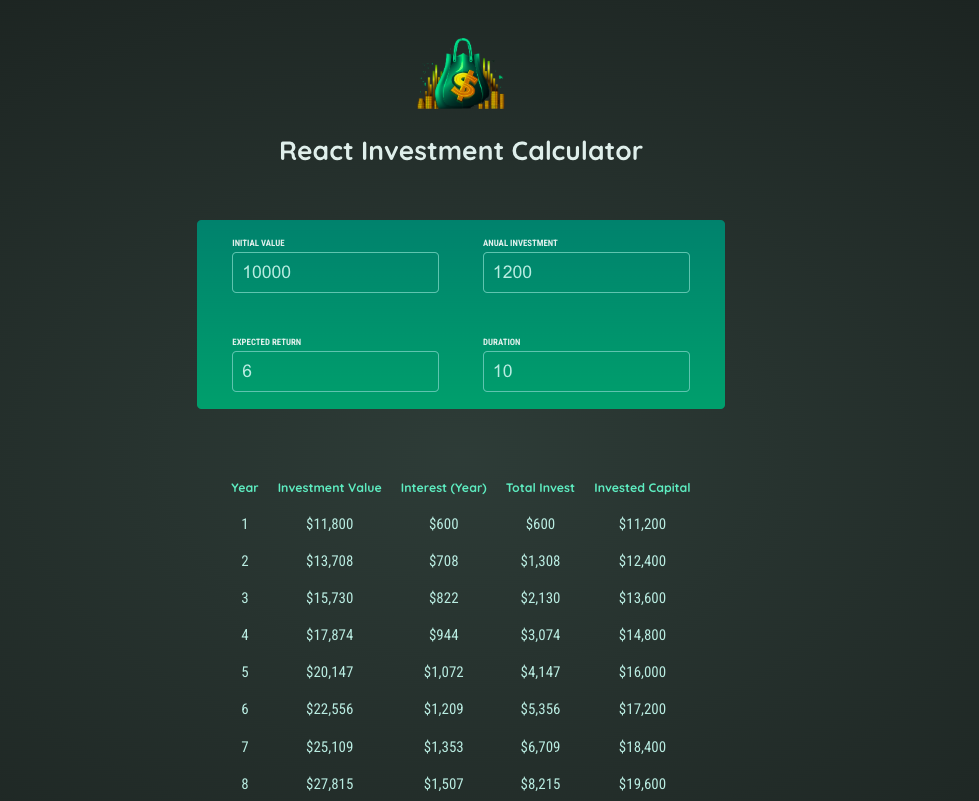

# 💰 React Investment Calculator
Aplicação desenvolvida para praticar os conceitos essenciais do **React.js**, como **componentes**, **state** e **props**, em um projeto funcional e útil para simulação de investimentos.

---

### 🎯 Objetivo
Consolidar os fundamentos do React criando uma calculadora de investimentos que permita ao usuário visualizar a projeção do crescimento financeiro ao longo do tempo.

---

### ⚙️ Funcionamento
O usuário pode:

- Informar o valor inicial do investimento
- Definir a contribuição anual
- Inserir a taxa de juros (anual)
- Estabelecer o período de investimento (em anos)

Com base nesses dados, a aplicação calcula e exibe o crescimento do investimento ao longo do tempo.

---

### 🛠️ Tecnologias Utilizadas
- HTML5
- CSS3
- JavaScript (ES6+)
- React.js (com hooks para gerenciamento de estado)

---

### 📸 Captura de Tela

---

### 🌐 Acesse a Aplicação Online
Teste a aplicação diretamente no seu navegador pelo link abaixo:

<a href="https://react-investment-calculator-qmj7.onrender.com" target="_blank">👉 Abrir Calculadora de Investimentos</a>

---